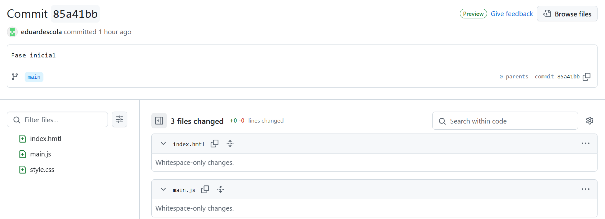
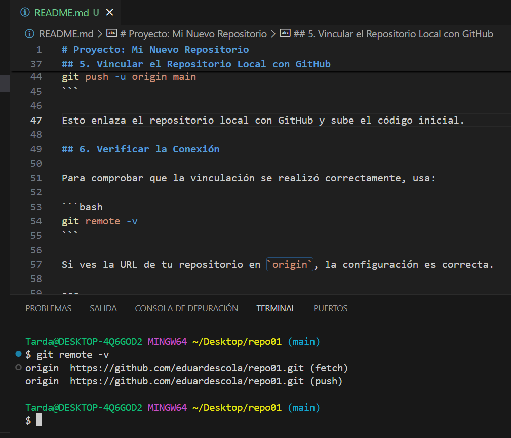
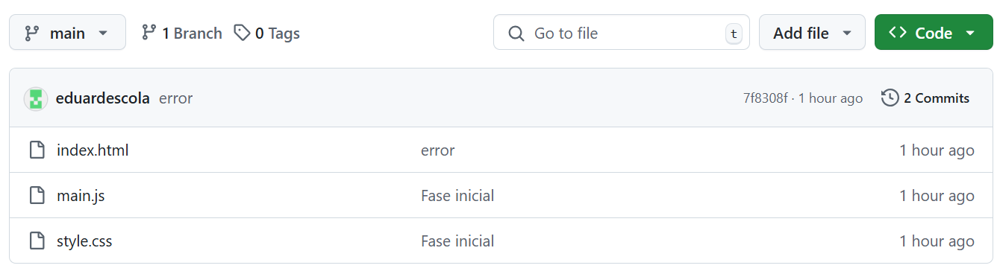

# Proyecto: Mi Nuevo Repositorio

Este documento describe los pasos para crear un repositorio local, vincularlo con un repositorio remoto en GitHub y añadir archivos base.

## 1. Crear un Repositorio Local

Ejecuta los siguientes comandos en Bash para crear un nuevo directorio y un repositorio local:

```bash
mkdir repo01
cd repo01
git init
```

Esto creará una carpeta `repo01` e iniciará un repositorio Git dentro de ella.

## 2. Crear Archivos Base

Crea los archivos principales del proyecto:

index.html style.css main.js


## 3. Realizar el Primer Commit

Añade los archivos al repositorio y realiza un primer commit:

```bash
git add .
git commit -m "Fase inicial"
```



## 4. Crear un Repositorio Remoto

Dirígete a [GitHub](https://github.com/) y crea un nuevo repositorio.

## 5. Vincular el Repositorio Local con GitHub

Copia la URL del repositorio en GitHub y ejecuta:

```bash
git remote add origin https://github.com/eduardescola/repo01.git
git branch -M main
git push -u origin main
```

Esto enlaza el repositorio local con GitHub y sube el código inicial.

## 6. Verificar la Conexión

Para comprobar que la vinculación se realizó correctamente, usa:

```bash
git remote -v
```

Si ves la URL de tu repositorio en `origin`, la configuración es correcta.

---

¡Listo! Ahora puedes seguir trabajando en tu proyecto, realizar cambios y subirlos a GitHub con `git push`.
